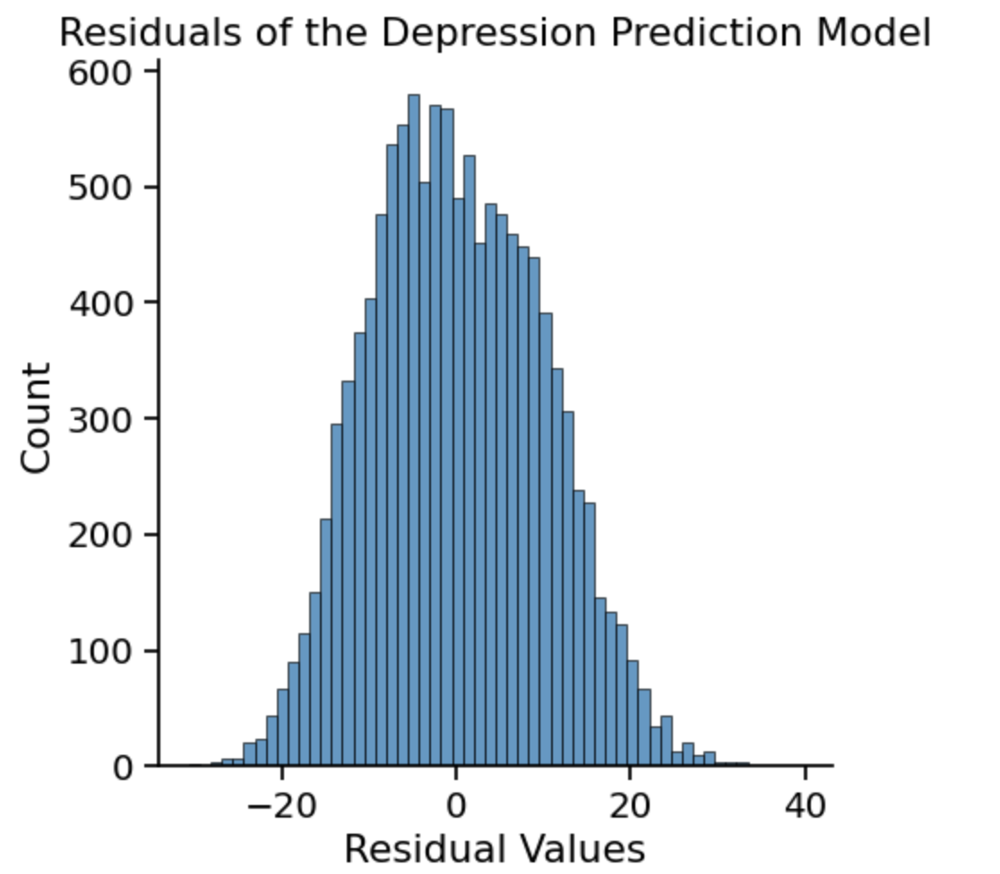

# Predicting Depression, Anxiety, and Stress from Personality Inventory Scores via Linear Regression

Code [here](DASS-TAPI.ipynb) and data [here](https://www.kaggle.com/datasets/lucasgreenwell/depression-anxiety-stress-scales-responses?resource=download)
